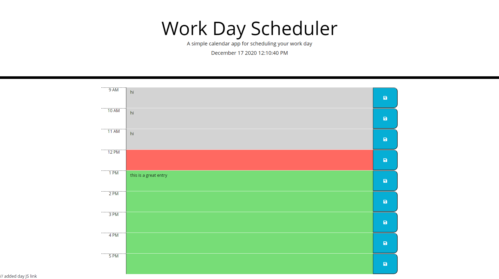

## Day Planner

#### **Table of Contents**
---
1. [Installalation](#installation)
1. [Trials](#trials)
1. [Usage](#usage)
1. [Credits](#credits)
1. [License](#license)

#### **Installation**
---
To intall this application using prebuilt html and css elements involved this:

1. Constructed the first row in html, to verify the look was what I wanted. 
1. Installed the day.JS CDN and read up on documentation.
1. Developed a for loop to dynamically make all rows of the calender, using approiate classes for the css, and using said css classes a color scheme was installed to show if an hour has passed or is upcoming.
1. Configured the buttons to save the notes in the text input to be saved into local data.
1. Reconfigued the for loop to get the local data as it is being populated.

#### **Trials**
---
The under lying principles of this task were on the more simple side, but learning to read the documentation and implement a JavaScript libraray was refreshing and rewarding.

#### **Usage**
---
The usage of this site is very simple.  In the text area in the middle of the page, you can type any notations you wish and click the save button on the right side of the row that is corresponding to the text input you are writing in.  Once clicked the text will be saved and when the application is reloaded the text will still be present. 

Link to the deployed website can be found [here](https://jerler1.github.io/dayplanner/).

#### **Credits**
---
Thanks to Day JS. [Link to day JS website](https://day.js.org/en/).

#### **License**
---

Copyright (c) 2005-2020 David Heinemeier Hansson

Permission is hereby granted, free of charge, to any person obtaining
a copy of this software and associated documentation files (the
"Software"), to deal in the Software without restriction, including
without limitation the rights to use, copy, modify, merge, publish,
distribute, sublicense, and/or sell copies of the Software, and to
permit persons to whom the Software is furnished to do so, subject to
the following conditions:

The above copyright notice and this permission notice shall be
included in all copies or substantial portions of the Software.

THE SOFTWARE IS PROVIDED "AS IS", WITHOUT WARRANTY OF ANY KIND,
EXPRESS OR IMPLIED, INCLUDING BUT NOT LIMITED TO THE WARRANTIES OF
MERCHANTABILITY, FITNESS FOR A PARTICULAR PURPOSE AND
NONINFRINGEMENT. IN NO EVENT SHALL THE AUTHORS OR COPYRIGHT HOLDERS BE
LIABLE FOR ANY CLAIM, DAMAGES OR OTHER LIABILITY, WHETHER IN AN ACTION
OF CONTRACT, TORT OR OTHERWISE, ARISING FROM, OUT OF OR IN CONNECTION
WITH THE SOFTWARE OR THE USE OR OTHER DEALINGS IN THE SOFTWARE.

